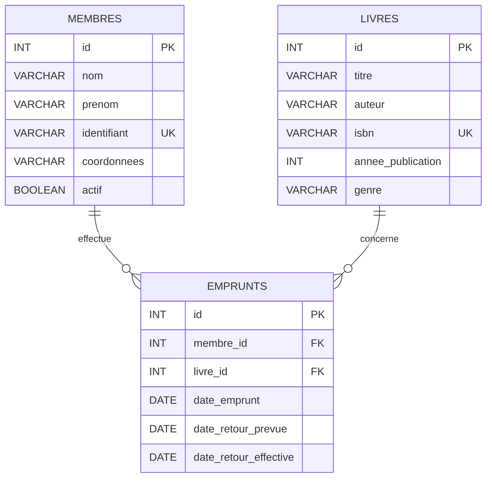

# Gestion de bibliothèque en Java

Application de bureau permettant de gérer les livres, les membres et les emprunts d'une bibliothèque. L'interface est développée avec **Java Swing** et les données sont conservées dans une base **MySQL** à l'aide de **JDBC**.

## Fonctionnalités

### Livres

- afficher l'ensemble du catalogue ;
- ajouter, modifier et supprimer un livre ;
- rechercher par titre, auteur ou ISBN ;
- filtrer par genre ou par année de publication.

### Membres

- afficher les membres actifs et inactifs ;
- ajouter, modifier et supprimer un membre ;
- désactiver un membre sans supprimer ses informations.

### Emprunts

- enregistrer l'emprunt d'un livre par un membre ;
- empêcher qu'un livre déjà emprunté soit emprunté une seconde fois ;
- calculer automatiquement une date de retour prévue à **14 jours** ;
- enregistrer le retour effectif à la date du jour ;
- afficher et supprimer l'historique des emprunts.

## Technologies utilisées

- Java 8 ou version ultérieure (Java 17 recommandé) ;
- Swing pour l'interface graphique ;
- JDBC pour l'accès aux données ;
- MySQL et MySQL Connector/J ;
- Visual Studio Code avec l'Extension Pack for Java (facultatif).

## Architecture du projet

```text
.
├── src/com/monapp/
│   ├── App.java             # Fenêtre principale et point d'entrée
│   ├── Livre.java           # Modèle d'un livre
│   ├── LivreDAO.java        # Accès aux livres en base
│   ├── LivreForm.java       # Formulaire livre
│   ├── Membre.java          # Modèle d'un membre
│   ├── MembreDAO.java       # Accès aux membres en base
│   ├── MembreForm.java      # Formulaire membre
│   ├── Emprunt.java         # Modèle d'un emprunt
│   ├── EmpruntDAO.java      # Accès aux emprunts en base
│   └── EmpruntForm.java     # Formulaire d'emprunt
└── .vscode/                 # Configuration de compilation et de lancement
```

L'application suit une organisation simple :

- les classes `Livre`, `Membre` et `Emprunt` représentent les données métier ;
- les classes `*DAO` exécutent les requêtes SQL avec des requêtes préparées ;
- les classes `*Form` gèrent les boîtes de dialogue de saisie ;
- `App` construit l'interface à onglets et coordonne les formulaires et les DAO.

## Modèle de données



## Installation

### 1. Prérequis

Installer les éléments suivants :

- un JDK avec les commandes `java` et `javac` disponibles dans le terminal ;
- un serveur MySQL en cours d'exécution ;
- le pilote JDBC MySQL Connector/J.

Vérifier Java avec :

```bash
java -version
javac -version
```

### 2. Ajouter le pilote MySQL

Créer un dossier `lib` à la racine du projet, puis y placer le fichier JAR de MySQL Connector/J sous le nom suivant :

```text
lib/mysql-connector.jar
```

Ce chemin correspond à la configuration fournie dans `.vscode/tasks.json` et `.vscode/launch.json`. Le dossier `lib` est ignoré par Git : chaque installation locale doit donc ajouter son propre pilote.

### 3. Créer la base de données

Exécuter le script suivant dans MySQL :

```sql
CREATE DATABASE IF NOT EXISTS bibliotheque
    CHARACTER SET utf8mb4
    COLLATE utf8mb4_unicode_ci;

USE bibliotheque;

CREATE TABLE livres (
    id INT AUTO_INCREMENT PRIMARY KEY,
    titre VARCHAR(255) NOT NULL,
    auteur VARCHAR(255) NOT NULL,
    isbn VARCHAR(20),
    annee_publication INT NOT NULL,
    genre VARCHAR(100),
    CONSTRAINT uq_livres_isbn UNIQUE (isbn)
) ENGINE=InnoDB;

CREATE TABLE membres (
    id INT AUTO_INCREMENT PRIMARY KEY,
    nom VARCHAR(100) NOT NULL,
    prenom VARCHAR(100) NOT NULL,
    identifiant VARCHAR(100) NOT NULL,
    coordonnees VARCHAR(255),
    actif BOOLEAN NOT NULL DEFAULT TRUE,
    CONSTRAINT uq_membres_identifiant UNIQUE (identifiant)
) ENGINE=InnoDB;

CREATE TABLE emprunts (
    id INT AUTO_INCREMENT PRIMARY KEY,
    membre_id INT NOT NULL,
    livre_id INT NOT NULL,
    date_emprunt DATE NOT NULL,
    date_retour_prevue DATE NOT NULL,
    date_retour_effective DATE NULL,
    CONSTRAINT fk_emprunts_membre
        FOREIGN KEY (membre_id) REFERENCES membres(id),
    CONSTRAINT fk_emprunts_livre
        FOREIGN KEY (livre_id) REFERENCES livres(id),
    INDEX idx_emprunts_livre_retour (livre_id, date_retour_effective),
    INDEX idx_emprunts_membre (membre_id)
) ENGINE=InnoDB;
```

Les clés étrangères protègent l'historique : MySQL refusera la suppression physique d'un livre ou d'un membre encore référencé par un emprunt. Dans ce cas, conserver l'enregistrement ou supprimer préalablement les emprunts associés.

### 4. Configurer la connexion

La connexion est actuellement définie directement dans `src/com/monapp/App.java` :

```java
DriverManager.getConnection(
    "jdbc:mysql://localhost:3306/bibliotheque?useSSL=false&serverTimezone=UTC",
    "root",
    ""
);
```

Adapter l'adresse du serveur, le port, le nom de la base, l'utilisateur et le mot de passe à l'environnement local. Pour un usage réel, il est préférable de créer un utilisateur MySQL dédié plutôt que d'utiliser `root`.

Exemple :

```sql
CREATE USER 'bibliotheque_app'@'localhost' IDENTIFIED BY 'mot_de_passe_solide';
GRANT SELECT, INSERT, UPDATE, DELETE
    ON bibliotheque.* TO 'bibliotheque_app'@'localhost';
FLUSH PRIVILEGES;
```

## Compilation et lancement

### Depuis un terminal Linux ou macOS

```bash
mkdir -p out
javac -encoding UTF-8 -cp "lib/mysql-connector.jar" -d out src/com/monapp/*.java
java -cp "out:lib/mysql-connector.jar" com.monapp.App
```

### Depuis Windows (PowerShell)

```powershell
New-Item -ItemType Directory -Force out | Out-Null
javac -encoding UTF-8 -cp "lib/mysql-connector.jar" -d out src/com/monapp/*.java
java -cp "out;lib/mysql-connector.jar" com.monapp.App
```

### Depuis Visual Studio Code

1. Ouvrir le dossier du projet dans VS Code.
2. Vérifier que `lib/mysql-connector.jar` est présent.
3. Lancer la tâche de compilation avec `Ctrl+Shift+B`.
4. Ouvrir la vue **Run and Debug**, puis démarrer **Debug App**.

## Utilisation

Au démarrage, l'application ouvre une fenêtre comportant trois onglets :

1. **Livres** : gérer le catalogue et utiliser les champs de recherche ou de filtre.
2. **Membres** : gérer les adhérents et leur état actif/inactif.
3. **Emprunts** : saisir l'identifiant numérique du membre et celui du livre, puis enregistrer le retour depuis la ligne sélectionnée.

Les erreurs de saisie ou de base de données sont affichées dans des boîtes de dialogue. Lorsqu'un livre possède déjà un emprunt sans date de retour effective, un nouvel emprunt est refusé.

## Règles métier implémentées

- la durée prévue d'un emprunt est fixée à 14 jours ;
- un livre est disponible lorsqu'aucun emprunt le concernant n'a une date de retour effective nulle ;
- un retour est daté avec la date système au moment du clic sur **Retourner** ;
- les recherches de livres portent sur le titre, l'auteur et l'ISBN ;
- la désactivation d'un membre conserve son historique.

## Limites actuelles et pistes d'amélioration

- les paramètres de connexion sont codés en dur dans `App.java` ;
- le projet ne dispose pas encore de Maven ou Gradle pour gérer automatiquement le pilote JDBC ;
- le schéma de base n'est pas fourni sous forme de fichier de migration ;
- aucun test automatisé n'est présent ;
- la création d'un emprunt demande de connaître les ID numériques du membre et du livre ;
- l'état actif d'un membre n'est pas contrôlé lors de l'emprunt ;
- aucune gestion des réservations, pénalités de retard ou authentification n'est encore implémentée.

Des évolutions naturelles seraient d'externaliser la configuration, d'ajouter un outil de build, des listes de sélection dans le formulaire d'emprunt, des tests DAO et une vue consacrée aux retards.

## Licence

Aucune licence n'est actuellement définie pour ce projet.
